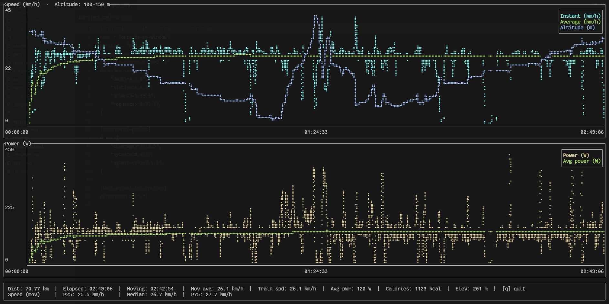

# my-watts: GPS Analyzer for Bike Rides

[](https://github.com/PierreSelim/my-watts/actions/workflows/ci.yml)
[](https://codecov.io/gh/PierreSelim/my-watts)

A Rust tool to analyze GPX files from bike tracking applications: smooth GPS drift, estimate power from physics, and produce per-point and aggregated ride metrics with an interactive terminal plot.

## Features

- **GPS Drift Correction**: Savitzky-Golay polynomial smoothing
- **Power Estimation**: Physics-based wattage from gravity, rolling resistance, and air drag
- **Ride Analysis**: Per-point metrics, interval summaries (1/5/10/30 min and 1/5/10 km), and elevation gain
- **Interactive Plot**: Terminal chart for speed, altitude, and power
- **Ride Index**: Analyzed rides are indexed automatically and browsable in an interactive list

## Building

```bash
cargo build --release
```

## Running

Four subcommands are available: `smooth`, `power`, `analyze`, and `list`. See [SPEC.md](SPEC.md) for full option lists and output column definitions.

```bash
# Smooth GPS drift only (writes CSV)
cargo run --release -- smooth my_ride.gpx

# Estimate power only (writes CSV)
cargo run --release -- power my_ride.gpx --rider-weight 72 --bike gravel

# Full analysis: smooth + power + intervals + interactive plot
cargo run --release -- analyze my_ride.gpx --rider-weight 72 --bike gravel

# Wider stop buffer for Training speed (default: 10 s)
cargo run --release -- analyze my_ride.gpx --rider-weight 72 --stop-buffer-secs 20

# Browse previously analyzed rides; press Enter to re-open a ride's plot
cargo run --release -- list
```

`analyze` records each ride in an index automatically; `list` reads that index — no extra step is needed.

## Output

| Command | Files produced | Location |
|---------|----------------|----------|
| `smooth`  | `input.smoothed.csv` — smoothed lat/lon/alt + original timestamp | current dir |
| `power`   | `input.power.csv` — power, speed, gradient per segment | current dir |
| `analyze` | `input.analyze.csv` — enriched per-point metrics<br>`input.intervals.csv` — aggregated summaries at 7 windows<br>Interactive terminal plot (skip with `--no-plot`) | `~/.my-watts/analysis/` (Unix)<br>`%USERPROFILE%\.my-watts\analysis\` (Windows) |
| `analyze` | `index.json` — ride index (updated automatically) | `~/.my-watts/` (Unix)<br>`%USERPROFILE%\.my-watts\` (Windows) |
| `list`    | _(none)_ — interactive table of indexed rides; Enter re-opens a ride's plot | reads `~/.my-watts/index.json` |

All CSV column definitions live in [SPEC.md](SPEC.md).

The TUI looks like



## Configuration

Bike presets and user defaults live in `config.toml` at the platform config dir (`%APPDATA%\my-watts\` on Windows, `~/.config/my-watts/` on Unix). See [SPEC.md](SPEC.md#configuration) for the schema.

## Testing & Code Quality

```bash
cargo test                                  # Run all tests
cargo fmt --check                           # Verify formatting (CI gate)
cargo clippy --all-targets -- -D warnings   # Lint exactly as CI does (warnings = errors, tests included)
cargo tarpaulin --out Html                  # Coverage report
```

CI runs `cargo fmt --check`, `cargo clippy --all-targets -- -D warnings`, and `cargo test`. Run the
clippy command above before pushing — a bare `cargo clippy` skips test code and can pass when CI fails.

## Documentation

- **[SPEC.md](SPEC.md)** — Feature specifications, algorithm choices, CLI reference, output formats
- **[ARCHITECTURE.md](ARCHITECTURE.md)** — Module structure, key types, data flow, design rationale
